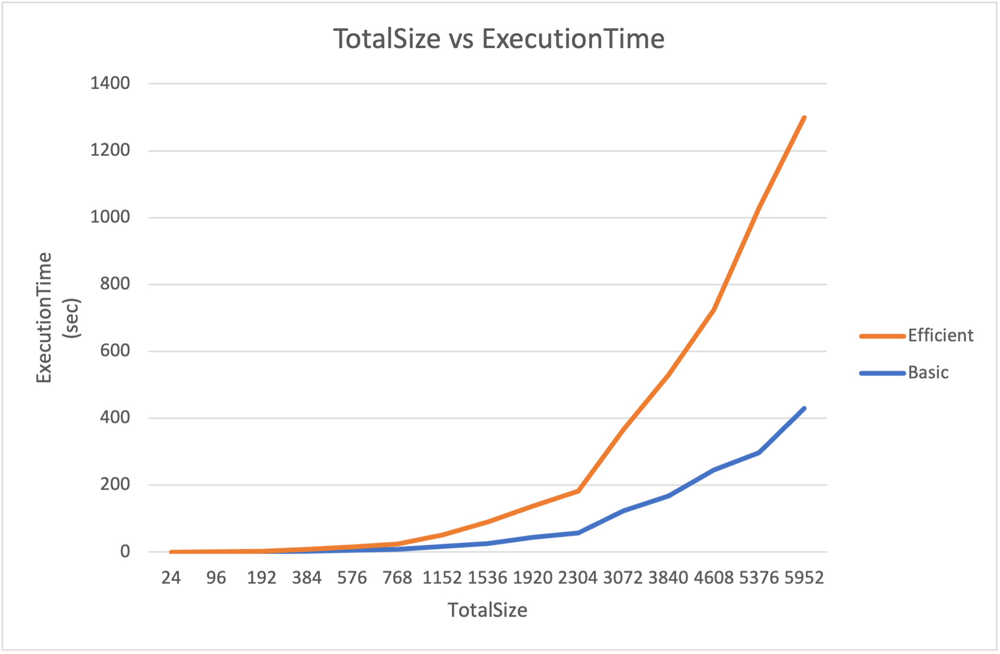

# CSCI570AlgorFinalProject

## I. Guidelines

The project is related to the implementation of the two different solutions discussed in Week 8 of the Lecture for the _Sequence Alignment_ problem.

## II. Project Discription:

Implement the basic Dynamic Programming solution to the Sequence Alignment problem. Run the test set provided and show your results.

### Algorithm Description

Suppose we are given two strings 𝑋 and 𝑌, where 𝑋 consists of the sequence of
symbols $${𝑥_1 𝑥_2 , ... , 𝑥_𝑚}$$ and 𝑌 consists of the sequence of symbols $${𝑦_1, 𝑦_2 , ... , 𝑦_𝑛}$$. Consider the sets {1, 2, ... , 𝑚} and {1, 2, ... , 𝑛} as representing the different positions in the strings 𝑋 and 𝑌, and consider a matching of these sets; Recall that a matching is a set of ordered pairs with the property that each item occurs in at most one pair. We say that a matching 𝑀 of these two sets is an alignment if there are no “crossing” pairs: if (𝑖, 𝑗), (𝑖', 𝑗') ε 𝑀 and 𝑖 < 𝑖' , then 𝑗 < 𝑗'. Intuitively, an alignment gives a way of lining up the two strings, by telling us which pairs of positions will be lined up with one another.

### How to execute

1. first run the following bash file with these commands to generate the result
   at `output1.txt` and `output2.txt` from given input in SampleTestCases ex: `input1.txt`

```linux=
sudo sh basic.sh
sudo sh efficient.sh
```

2. run the `generate_point.sh` file to run all test files from datapoints directory, the command will generate `basic.csv` and `efficient.csv` containing results from datapoints

```linux=
sudo sh generate_point.sh
```

3. We then can create the plot from excel and see the difference between 2 algorithm

### Summary

#### Datapoints

| M+N  | Time in MS (Basic) | Time in MS (Efficient) | Memory in KB (Basic) | Memory in KB (Efficient) |
| :--- | :----------------- | :--------------------- | :------------------- | :----------------------- |
| 24   | 0.273              | 0.083                  | 1424                 | 1424                     |
| 96   | 0.474              | 0.501                  | 1424                 | 1456                     |
| 192  | 0.72               | 1.492                  | 1488                 | 1504                     |
| 384  | 2.773              | 5.141                  | 1744                 | 1536                     |
| 576  | 5.401              | 10.432                 | 2016                 | 1616                     |
| 768  | 8.442              | 16.492                 | 2096                 | 1632                     |
| 1152 | 16.703             | 35.432                 | 2800                 | 2128                     |
| 1536 | 25.919             | 64.016                 | 3952                 | 2432                     |
| 1920 | 43.767             | 94.457                 | 4976                 | 2336                     |
| 2304 | 57.602             | 124.701                | 6592                 | 2608                     |
| 3840 | 168.151            | 362.338                | 15072                | 2992                     |
| 4608 | 246.269            | 478.232                | 20992                | 3216                     |
| 5376 | 297.722            | 731.405                | 27728                | 3632                     |
| 5952 | 429.487            | 869.705                | 33440                | 3664                     |

#### Insights

We can see that during the first sequences with small size, the execution time and memory usage won’t be different that much. However, as the sequences become larger, the memory usage of efficient method can be 10 times smaller than the basic method, which is very impressing. In addition, the execution time of the efficient method becomes about twice as the basic method, which similar to the analysis of the time complexity O(2 \*C mn) vs O(mn)

#### Graph1 - Memory vs Problem Size (M+N)


##### Explanation

For efficient method is O(m + n), where m = length of sequence 1, n = length of sequence 2. This is because we apply recursive calls sequentially and reuse the working space from one call to the next.

#### Graph2 - Execution Time vs Problem Size (M+N)



##### Explanation

When the sequence become much more bigger, the efficient method have to divide several times to cut down the problem, and that process may affect the total execution time than basic method, which deal with the sequence directly.
